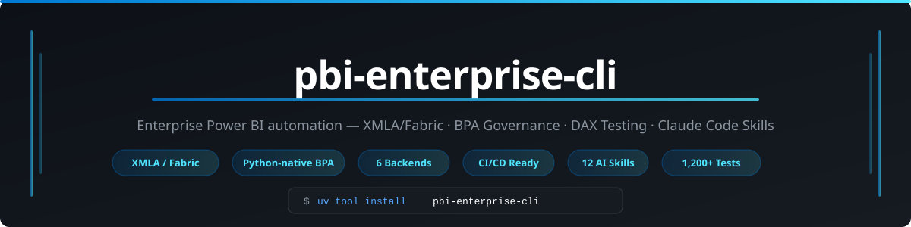
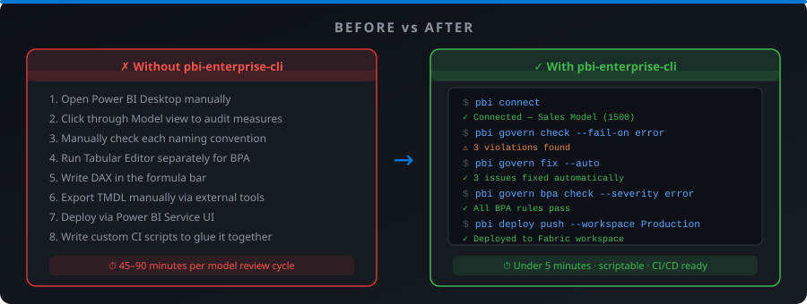
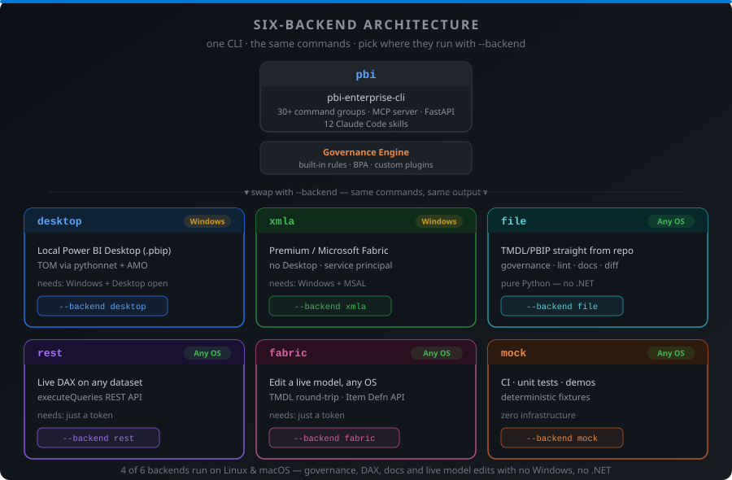

<div align="center">
  
</div>

<div align="center">

[](https://github.com/mudassir09/pbi-enterprise-cli/actions/workflows/ci.yml)
[](https://codecov.io/gh/mudassir09/pbi-enterprise-cli)
[](https://pypi.org/project/pbi-enterprise-cli/)
[](https://pypi.org/project/pbi-enterprise-cli/)
[](https://github.com/mudassir09/pbi-enterprise-cli/blob/main/LICENSE)
[](https://pypi.org/project/pbi-enterprise-cli/)

</div>

---

**pbi-enterprise-cli** is the enterprise-grade Power BI automation CLI — XMLA/Fabric connectivity without Desktop, the only Python-native BPA governance runner, semantic model management, DAX testing, PBIR authoring, and 10 Claude Code skills.

**Key differentiators vs alternatives:**

- **XMLA / Fabric without Desktop** — connect directly to Premium or Fabric workspaces via service principal or managed identity; no GUI required
- **Python-native BPA runner** — the only Python implementation of Best Practice Analyzer; runs on `ubuntu-latest` in CI with zero extra tooling
- **Three backends, one API** — `desktop` (TOM), `xmla` (Premium/Fabric), `mock` (CI) — same commands, same output, swap with `--backend`
- **AMO DLLs bundled** — works after `pip install`; no separate Desktop installation needed for XMLA
- **CI/CD first** — governance gate, DAX unit tests, and snapshot/rollback all work in GitHub Actions on `ubuntu-latest`
- **10 Claude Code skills** — install with `pbi connect` for AI-assisted Power BI development in under 60 seconds

---

## Installation

**Recommended — [uv](https://docs.astral.sh/uv/) (fastest, manages Python automatically, no PATH issues on Windows):**
```bash
uv tool install pbi-enterprise-cli
uv tool install "pbi-enterprise-cli[all]"   # all optional features
```

**Alternative — [pipx](https://pipx.pypa.io/):**
```bash
pipx install pbi-enterprise-cli
```

**Fallback — pip:**
```bash
pip install pbi-enterprise-cli
```

**With specific extras:**
```bash
uv tool install "pbi-enterprise-cli[ai,xmla]"     # Claude AI + XMLA/Fabric
uv tool install "pbi-enterprise-cli[sources]"     # SQL / Excel / REST profiling
uv tool install "pbi-enterprise-cli[server]"      # FastAPI REST server
uv tool install "pbi-enterprise-cli[viz]"         # WCAG theme validation
```

> **Requirements:** Python 3.10–3.13. The `desktop` and `xmla` backends require Windows. The `mock` backend works on Linux and macOS — CI pipelines need no Windows runner for governance, BPA, and DAX tests.

---

## 60-Second Quickstart

```bash
# 1. Verify setup
pbi doctor

# 2. Connect to open Power BI Desktop + install all 10 Claude Code skills
pbi connect

# 3. Explore the model
pbi model tables
pbi measure list

# 4. Run governance and BPA
pbi govern check --fail-on error
pbi govern bpa check --severity error

# 5. Fix safe violations automatically
pbi govern fix --auto

# 6. Run DAX unit tests
pbi dax test --suite ./tests/measures/

# 7. Deploy to Fabric (XMLA)
pbi deploy push --connection fabric-prod
```

---

## Before vs After

<div align="center">
  
</div>

---

## Command Reference

| Area | Commands |
|---|---|
| **Semantic model** | `pbi model` — tables, columns, relationships, lint, lineage |
| **DAX measures** | `pbi measure` — add, update, delete, AI-generate, audit |
| **DAX testing** | `pbi dax` — query, validate, YAML unit-test suites |
| **Source profiling** | `pbi source` — SQL, Excel, CSV, REST → star-schema scaffold |
| **Calendar** | `pbi calendar` — generate date tables, fiscal year, mark-as-date-table |
| **Report authoring** | `pbi report` — pages, bookmarks, drillthrough (PBIR GA format) |
| **Visuals** | `pbi visual` — 32 visual types, conditional formatting, data bars |
| **Layout** | `pbi layout` — shelf-packing auto-layout, named templates |
| **Themes** | `pbi theme` — generate WCAG-compliant themes from a brand colour |
| **Filters** | `pbi filter` — relative-date, TopN, basic value filters |
| **Governance** | `pbi govern` — built-in rules + BPA + custom plugins, `--fail-on` CI gate |
| **Security (RLS)** | `pbi security` — role add/delete/test, perspectives |
| **Partitions** | `pbi partition` — add, refresh, delete, incremental refresh |
| **Deployment** | `pbi deploy` — snapshot, diff, push via XMLA |
| **Snapshots** | `pbi snapshot` — create, list, restore, diff — model rollback |
| **Environments** | `pbi env` — named connections, use, diff, promote (dev → prod) |
| **TMDL** | `pbi database` — export / import TMDL snapshots |
| **Docs** | `pbi docs` — markdown/Confluence data dictionary, lineage, audit log |
| **Diagnostics** | `pbi doctor` — check pythonnet, optional deps, platform |
| **Watch mode** | `pbi watch` — re-run governance + DAX tests on file change |
| **REST API** | `pbi server` — authenticated FastAPI server for pipeline integration |
| **Skills** | `pbi skills` — install, list, check 10 Claude Code Power BI skills |

---

## Three-Backend Architecture

<div align="center">
  
</div>

| Backend | When to use | Requires |
|---|---|---|
| `desktop` (default) | Local Power BI Desktop with a `.pbip` project open | Windows + Desktop |
| `xmla` | Power BI Premium or Microsoft Fabric — no Desktop | Windows + MSAL (`[xmla]` extra) |
| `mock` | CI pipelines, unit tests, demos | Nothing — works on Linux/macOS |

```bash
# Swap with --backend
pbi --backend mock govern check --fail-on error    # CI on ubuntu-latest
pbi --backend xmla model tables                    # Fabric without Desktop
pbi --backend desktop measure list                 # local Desktop (default)
```

---

## The Only Python-Native BPA Runner

`pbi-enterprise-cli` is the only Python-native implementation of the [Best Practice Analyzer](https://docs.tabulareditor.com/BPA/Best-Practice-Analyzer.html) — run the same rule engine used by Tabular Editor without installing .NET 6 or Tabular Editor itself.

```bash
# Microsoft community BPA rules (fetched live — same ruleset as Tabular Editor)
pbi govern bpa check

# Filter to errors only — safe CI gate
pbi govern bpa check --severity error

# Local corporate rule file
pbi govern bpa check --file ./governance/CorpBPARules.json

# JSON output for downstream tooling
pbi --json govern bpa check --severity error
```

**GitHub Actions governance gate — works on `ubuntu-latest`, no Windows runner needed:**

```yaml
- name: BPA governance gate
  run: pbi --backend mock govern bpa check --severity error
```

**Custom governance plugin** — drop a `.py` file in `~/.pbi-cli/rules/`:

```python
from pbi_cli.governance.engine import GovernanceRule, Violation

class NoHardcodedDatesRule(GovernanceRule):
    id = "custom.no-hardcoded-dates"
    severity = "error"

    def check(self, model) -> list[Violation]:
        return [
            Violation(self, f"Measure '{m.name}' contains a hardcoded year")
            for m in model.measures
            if "2024" in m.expression or "2025" in m.expression
        ]
```

---

## Claude Code Skills

Run `pbi connect` to install all 10 skills into `~/.claude/skills/` in one step:

```bash
pbi connect    # connects to Desktop + installs skills + prints model summary
```

Or install manually:

```bash
pbi skills install --all
pbi skills check          # verify compatibility with installed CLI version
```

| Skill | Covers |
|---|---|
| `power-bi-modeling` | Star schema, source profiling, partitions, incremental refresh, calendar, M queries |
| `power-bi-dax` | DAX authoring, Time Intelligence, YAML unit tests, filter context, design patterns |
| `power-bi-performance` | Query tracing, benchmarking, VertiPaq, storage vs formula engine |
| `power-bi-report-design` | Pages, 32 visual types, bookmarks, drillthrough, auto-layout, conditional formatting |
| `power-bi-design-system` | WCAG themes, brand colours, typography, custom visual SDK |
| `power-bi-governance` | Built-in rules, BPA, custom plugins, auto-fix, CI gate |
| `power-bi-security-and-docs` | RLS, perspectives, role testing, data dictionary, lineage, audit logs |
| `power-bi-deployment` | XMLA deploy, TMDL snapshots, multi-environment promotion, auth setup |
| `power-bi-diagnostics` | `pbi doctor`, pythonnet/AMO resolution, error playbook, connection troubleshooting |
| `power-bi-project-orchestrator` | Coordinates multi-skill workflows: model → DAX → governance → report → deploy |

---

## CI/CD Integration

Full governance + BPA + DAX tests run on `ubuntu-latest` with the mock backend — no Windows runner, no Power BI infrastructure.

```yaml
# .github/workflows/pbi-govern.yml
name: Power BI Governance

on: [push, pull_request]

jobs:
  govern:
    runs-on: ubuntu-latest
    steps:
      - uses: actions/checkout@v4
      - run: pip install pbi-enterprise-cli

      - name: Governance rules
        run: pbi --backend mock govern check --fail-on error

      - name: BPA check
        run: pbi --backend mock govern bpa check --severity error

      - name: DAX unit tests
        run: pbi --backend mock dax test --suite ./tests/measures/

      - name: Upload governance report
        if: always()
        run: pbi --backend mock --json govern check > governance-report.json
      - uses: actions/upload-artifact@v4
        if: always()
        with:
          name: governance-report
          path: governance-report.json
```

---

## Global Flags

| Flag | Purpose |
|---|---|
| `--backend desktop\|xmla\|mock` | Select backend (default: `desktop`) |
| `--dry-run` | Preview changes without applying them |
| `--json` | Machine-readable JSON output |
| `--connection <name>` | Use a named connection from `~/.pbi-cli/connections.json` |
| `--port 5000` | Desktop local server port |

## Exit Code Contract

| Code | Meaning |
|---|---|
| `0` | Success |
| `1` | User error — bad args, missing flags |
| `2` | Connection error — Desktop not open, XMLA unreachable |
| `3` | Validation error — governance violation, schema error |
| `4` | Operation error — TOM write failed, partial completion |

## Environment Variables

| Variable | Purpose |
|---|---|
| `ANTHROPIC_API_KEY` | Claude AI for `pbi measure generate` |
| `PBI_SERVER_KEY` | API key for `pbi server start` |
| `PBI_CLIENT_SECRET` | Service principal secret for XMLA connections |
| `PBI_REST_BEARER` | Default Bearer token for REST source profiling |

---

## Contributing

Contributions are welcome. See [CONTRIBUTING.md](CONTRIBUTING.md) for setup instructions, branch strategy, and the PR process.

**Good First Issues** are labelled [`good first issue`](https://github.com/mudassir09/pbi-enterprise-cli/issues?q=label%3A%22good+first+issue%22) — these are self-contained tasks with clear acceptance criteria and no deep context required.

---

## Documentation

| Document | Contents |
|---|---|
| [docs/auth/xmla-auth.md](docs/auth/xmla-auth.md) | XMLA auth: service principal, managed identity, device flow |
| [docs/deployment.md](docs/deployment.md) | Snapshot format, diff algorithm, push safety, rollback |
| [CHANGELOG.md](CHANGELOG.md) | Release history |
| [SECURITY.md](SECURITY.md) | Security policy and vulnerability reporting |
| [CONTRIBUTING.md](CONTRIBUTING.md) | Branch strategy, coding standards, PR guide |
| [STABILITY.md](STABILITY.md) | Stable command surface, exit code contract, deprecation policy |

---

## License

MIT © [Mudassir](https://github.com/mudassir09) — see [LICENSE](LICENSE).

The bundled AMO/ADOMD client libraries are licensed under the [Microsoft Software License Terms](https://go.microsoft.com/fwlink/?LinkId=2179979).
