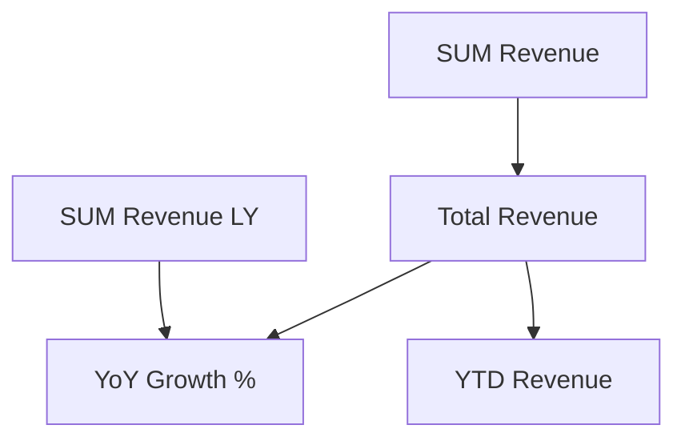

# power-bi-docs

## Quick Reference

```bash
# Generate full data dictionary
pbi docs generate --format markdown --output docs/data-dictionary.md
pbi docs generate --format confluence --output docs/data-dictionary.wiki

# Audience-specific outputs
pbi docs generate --audience technical --format markdown
pbi docs generate --audience business --format markdown
pbi docs generate --audience executive --format markdown

# Governance report
pbi govern check --json > docs/governance-report.json
```

---

## Audience-Aware Output Guide

### Technical Audience (developers, data engineers)

Includes: column data types, DAX expressions, relationship cardinality, measure complexity scores, dependency graphs.

```bash
pbi docs generate --audience technical --format markdown
```

Output sections:
- Full table schema with data types
- Complete DAX expressions for all measures
- Relationship diagram (Mermaid)
- Measure dependency graph
- Governance violations (if any)

### Business Audience (analysts, report users)

Includes: plain-English descriptions, measure definitions, what filters apply, what each page shows.

```bash
pbi docs generate --audience business --format markdown
```

Output sections:
- Business glossary (measure names → plain English)
- Column descriptions (from model metadata)
- "How to use" guide for each report page
- Refresh schedule (if available)

### Executive Audience (C-suite, managers)

Includes: KPI definitions only, data freshness, high-level model summary.

```bash
pbi docs generate --audience executive --format markdown
```

Output sections:
- One-line KPI definitions
- Data sources summary
- Last refresh timestamp
- Coverage metrics (% of measures documented)

---

## Data Dictionary Structure

A complete data dictionary output contains:

```markdown
# Data Dictionary — [Model Name]
Generated: 2025-01-15  |  Compatibility Level: 1565

## Tables
### Sales (Fact)
| Column | Type | Description |
|--------|------|-------------|
| SalesKey | Int64 | Surrogate key |
| OrderDate | DateTime | Date of order |
| Revenue | Decimal | Pre-tax revenue |

## Measures
### [Total Revenue]
**Table:** Sales  
**Expression:** `SUM(Sales[Revenue])`  
**Format:** `#,0.00`  
**Description:** Sum of all revenue across the filtered period.

### [YTD Revenue]
**Table:** Sales  
**Expression:** `TOTALYTD(SUM(Sales[Revenue]), Calendar[Date])`  
**Dependencies:** Calendar[Date], [Total Revenue]

## Relationships
| From | To | Cardinality | Active |
|------|----|-------------|--------|
| Sales[CustomerKey] | Customer[CustomerKey] | *:1 | Yes |
```

---

## Documentation Coverage Scoring

Run `pbi govern check` to get documentation coverage:

| Metric | Good | Needs Work |
|--------|------|-----------|
| Measures with description | > 80% | < 50% |
| Columns with description | > 60% | < 30% |
| Measures with format string | 100% | < 90% |
| Tables with description | > 70% | < 40% |

Auto-populate descriptions:
```bash
# Governance auto-fix adds default format strings
pbi govern fix --auto

# Then manually add descriptions via measure update
pbi measure update --table Sales --name "[Total Revenue]" \
  --description "Sum of all pre-tax revenue in the filtered context."
```

---

## Confluence Wiki Format

`--format confluence` outputs Confluence Storage Format markup:

```wiki
h1. Data Dictionary — Sales Model

h2. Measures

|| Name || Table || Expression || Description ||
| [Total Revenue] | Sales | SUM(Sales[Revenue]) | Pre-tax revenue total |
```

---

## Measure Dependency Graph (Mermaid)

```bash
pbi model lineage --format mermaid
```

Output:


Paste into any Mermaid renderer (GitHub, Confluence, Notion) for a visual dependency diagram.

---

## Keeping Docs in Sync

Add to your CI/CD pipeline to auto-regenerate docs on every model change:

```yaml
# .github/workflows/docs.yml
- name: Regenerate documentation
  run: |
    pbi docs generate --format markdown --output docs/data-dictionary.md
    git add docs/
    git commit -m "chore: regenerate data dictionary"
```

Or use the file watcher locally:
```bash
pbi watch --on-change "pbi docs generate --format markdown"
```
